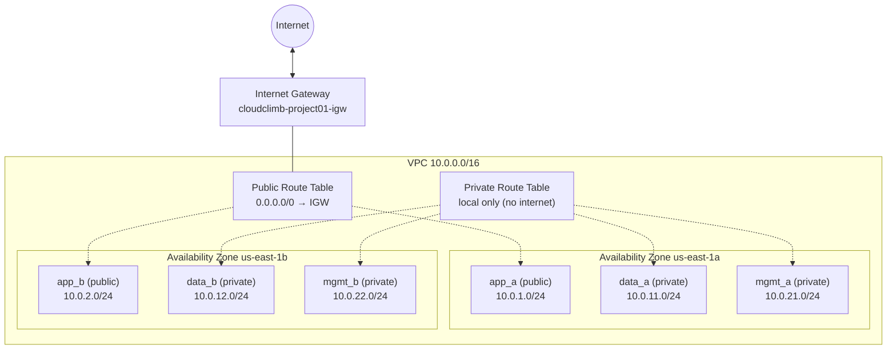

# AWS Week 01 Reference Solution — Network Foundation

This folder is the reference deployment for **Project 01 - Week 01** on the AWS track.

Week 01 builds the base network that every later week sits on: a segmented VPC across two Availability Zones, with public and private tiers, an Internet Gateway, routing, and security groups. No compute, database, or load balancer is deployed yet, this is the ground everything else will be built on.

## Architecture



## CIDR / addressing plan

VPC: **10.0.0.0/16** (65,536 addresses). Six **/24** subnets (256 addresses each), non-overlapping. The third octet encodes the tier and the AZ so any subnet is readable at a glance (1-2 = app, 11-12 = data, 21-22 = mgmt; first of each pair = AZ-a, second = AZ-b).

| Subnet | Tier | Access | CIDR | AZ |
|---|---|---|---|---|
| app_a | Application | public | 10.0.1.0/24 | us-east-1a |
| app_b | Application | public | 10.0.2.0/24 | us-east-1b |
| data_a | Data | private | 10.0.11.0/24 | us-east-1a |
| data_b | Data | private | 10.0.12.0/24 | us-east-1b |
| mgmt_a | Management | private | 10.0.21.0/24 | us-east-1a |
| mgmt_b | Management | private | 10.0.22.0/24 | us-east-1b |

## Design decisions

**Why two Availability Zones from the start.** In AWS a subnet lives in exactly one AZ, so building one subnet per tier would box us in later. Project 01 will add an Application Load Balancer (needs at least two AZs) and Amazon RDS with a multi-AZ DB subnet group (needs subnets in two AZs). Laying down two AZs now means those slot in later without re-doing the VPC or the CIDR math.

**What makes a subnet public vs private.** It is the route table, not a setting on the subnet. The public route table has a `0.0.0.0/0 → Internet Gateway` route, so the app subnets attached to it can reach the internet. The private route table has no internet route (only the automatic local route), so the data and mgmt subnets can only talk inside the VPC. Private is the absence of an internet route, not an explicit block.

**Why no NAT Gateway in Week 1.** A NAT Gateway lets private subnets make outbound-only internet calls, but it bills per hour plus per GB even when idle. Nothing in the private subnets needs outbound internet yet (no instances are deployed), so adding one now would cost money for no benefit. It can be introduced later if a private-tier resource actually needs outbound access.

**Security group boundaries.** The app security group allows HTTP (80) and HTTPS (443) inbound from anywhere, it is the public web tier. The data security group allows PostgreSQL (5432) inbound **only from the app security group**, not from any IP range, so the database is reachable by the app tier and nothing else, even inside the VPC. Both allow all outbound (security groups are stateful, so this does not loosen inbound). Inbound is scoped to the exact port and source needed; egress is left open as the standard baseline. These security groups are provisioned ahead of time: nothing attaches to them in Week 1 (no compute or database is deployed yet), but defining them now means the app and data tiers already have their network boundaries in place when EC2 and RDS arrive in later weeks.

## Files

| File | Purpose |
|---|---|
| `versions.tf` | Required Terraform and AWS provider versions |
| `providers.tf` | AWS provider config (region + default tags applied to every resource) |
| `variables.tf` | Inputs (region, project name, environment, owner, VPC CIDR) |
| `main.tf` | VPC, subnets (via `for_each`), IGW, route tables, associations, security groups |
| `outputs.tf` | Resource IDs surfaced after apply |

## Deploy

From the `aws/week-01` directory:

```bash
terraform init
terraform fmt
terraform validate
terraform plan
terraform apply
```

View the outputs:

```bash
terraform output
```

## Outputs

`vpc_id`, `subnet_ids`, `internet_gateway_id`, `public_route_table_id`, `private_route_table_id`, `app_security_group_id`, `data_security_group_id`.

## Notes

This is one working reference, not the only correct way to complete Week 01. Participants may structure their Terraform differently as long as the deployment meets the Week 01 requirements. It is released after Week 01 completes so participants attempt the work first, then compare.
